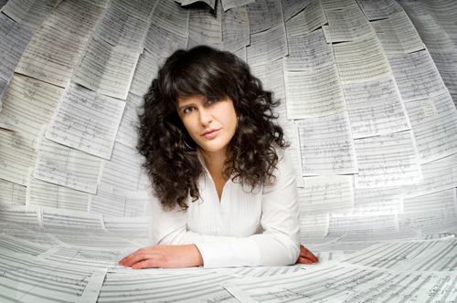

import DataWrapper from '../../../src/components/datawrapper/datawrapper.jsx'
import Accordion from '../../../src/components/accordion/accordion.jsx'

# Opernspielpläne in NRW: tot und männlich

## Wir haben die Spielpläne der kommunalen Opern-Bühnen in NRW abgefragt und analysiert.

Vorweg: Wir jammern auf hohem Niveau. Denn alles in allem steht es gut um die Oper in NRW. In der letzten Spielzeit gab es an 13 kommunalen Häusern über hundert Inszenierungen mit mehr als tausend Aufführungen. In anderen Worten: Opernfreunde hatten im Schnitt jeden Tag die Wahl zwischen rund drei Opernaufführungen.

### Deutsche Oper am Rhein mit den meisten Aufführungen
<DataWrapper
    aria-label="Während in Düsseldorf und Duisburg die deutsche Oper am Rhein auf 218 Aufführungen kommt, sind es in Herford nur 4."
    title="Deutsche Oper am Rhein mit den meisten Aufführungen"
    src="https://datawrapper.dwcdn.net/2gNYv/1/"
/>

Auch beim Genre Oper waren wir streng. Rausgefallen sind Musicals, Gala-Abende und Revues, die ja durchaus zur Belebung der Spielpläne beitragen, aber eben nicht ins Genre Oper fallen.

Schauen wir allerdings nur auf die Oper, dann ist das Angebot nicht so vielfältig, wie es sich auf den ersten Blick darstellt. Denn meistens begegnet das Publikum alten Bekannten:

### Zauberflöte vor Hänsel und Gretel
Wir zeigen alle Opern der NRW-Spielzeit in einer Grafik, sortiert nach Anzahl der Aufführungen. Wurde das Stück auch 'für Kinder' angeboten, haben wir es hier mit zusammen gefasst. Klicken sie auf einen Punkt, um die Anzahl der Aufführungen einzublenden.

<DataWrapper
    aria-label="76 mal wurde die Zauberflöte 2018/2019 in NRW aufgeführt, gefolgt von Hänsel und Gretel mit 34 Aufführungen."
    title="Zauberflöte vor Hänsel und Gretel"
    src="//datawrapper.dwcdn.net/azwpu/4/"
/>

Vor allem eine Oper ist bei fast allen Häusern zu finden:

### Die Zauberflöte wurde an 7 von 13 Häusern aufgeführt
Die gelben Punkte zeigen, wo die Zauberflöte zu sehen war. Klicken Sie einen Punkt an, um den Namen des Hauses und die Anzahl der Aufführungen zu sehen.

<DataWrapper
    aria-label="Aufführungen der Zauberflöte gab es in Köln (21 Aufführungen), Düsseldorf/Duisburg(15 Aufführungen), Bielefeld, Bonn, Essen, Krefeld Mönchengladbach"
    title="Die Zauberflöte wurde an 7 von 13 Häusern aufgeführt"
    src="//datawrapper.dwcdn.net/rAI3d/13/"
/>

Der Komponist Moritz Eggert wirft den deutschen Opernhäusern deswegen mangelnde Innovationskraft vor.

Zitat:
"Überlebenschance der Gattung Oper, wenn sich nicht grundlegend etwas ändert: 0%"
[Moritz Eggert]('https://blogs.nmz.de/badblog/2018/04/10/die-ernuechternde-opernstatistik-der-spielzeit-2017-2018/')

Denn die in NRW gespielten Opern sind im Schnitt 180 Jahre alt.

### Ältere KomponistInnen werden häufiger aufgeführt
 Zu sehen ist das Alter der Komponisten im Verhältnis zur Zahl der Aufführungen. Gelbe Quadrate stehen für lebende KomponistInnen, blaue Punkte für verstorbene.

<DataWrapper
    aria-label="Während lebende KomponistInnen oft nur 1-2 mal aufgeführt werden, werden Komponisten, die über 150 Jahre alt sind besonders häufig aufgeführt. Spitzenreiter sind Guiseppe Verdi und Wolfgang Amadeus Mozart."
    title="Ältere KomponistInnen werden häufiger aufgeführt"
    src="//datawrapper.dwcdn.net/48hJE/10/"
/>

Ist die Opernwelt im 19. Jahrhundert stehen geblieben? Immerhin jeder dritte der gespielten Komponisten ist nach 1919 geboren. Betrachtet man aber die Gesamtzahl aller Aufführungen, so sinkt das Verhältnis deutlich.

### Jede 3. KomponistIn wurde vor 1919 geboren, aber nur 12 % der Aufführungen stammen von ihnen
 Bei Klick auf 'KomponistInnen' ist zu sehen, wie das Verhältnis von älteren zu jüngeren KomponistInnen ist.

<DataWrapper
    aria-label="Jede 3. KomponistIn wurde vor 1919 geboren, aber nur 12 % der Aufführung stammen von ihnen."
    title="Nur 12 % der Aufführungen stammen von KomponistInnen, die jünger als 100 Jahre alt sind"
    src="//datawrapper.dwcdn.net/6D2bM/3/"
/>

Bei den lebenden Komponisten sind es vor allem Premieren von Uraufführungen, die aber nach wenigen Aufführungen wieder vom Spielplan verschwinden. Ein Verhältnis sticht außerdem sehr ins Auge:

### Nuria Núñez Hierro ist die einzige Frau
Hierros Kinderoper “Kleines Stück Himmel” wurde in Wuppertal acht mal aufgeführt.

<DataWrapper
    aria-label="In der Spielzeit 2018/2019 war unter 66 KomponistInnen nur eine Frau."
    title="Nuria Nunez Hierro ist die einzige Frau"
    src="//datawrapper.dwcdn.net/T56o1/2/"
/>

Nuria Núñez Hierro wurde 1980 in Jerez (Spanien) geboren.

Zitat:
"Es gibt so viele gute Komponistinnen. Dass noch immer keine gespielt werden, ist ein Skandal!"
Platzhalter-Zitat: Nura Nunez Hierro

Komponistin Nunez Herero fordert daher eine Quote für Frauen auf den Spielplänen.

Die Opern begründen ihre konservativen Spielpläne mit dem politischen Druck, die Auslastungszahlen hoch zu halten.

Zitat:
"Die Leute lieben eben Verdi. Mit zeitgenössischer Musik verschrecken Sie die Zuhörer!"
Platzhalter-Zitat: Intendant Oper Wuppertal
